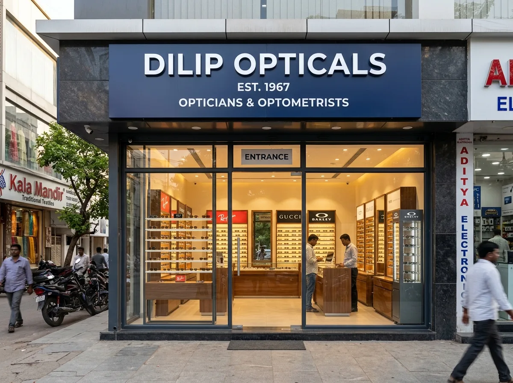
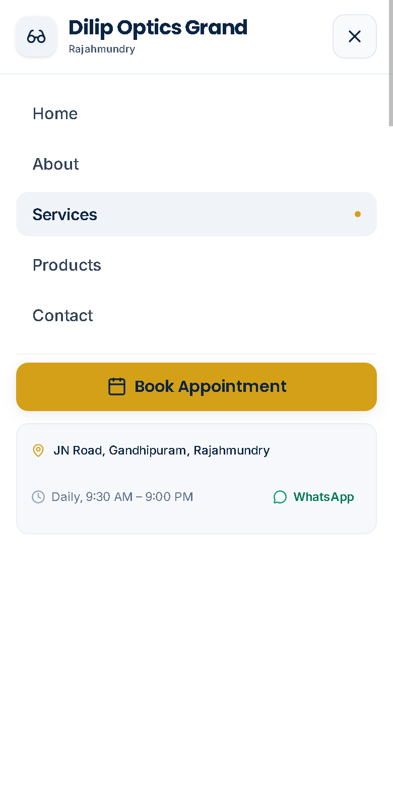

<div align="center">


<br/>

**A high-performance, mobile-first web application designed for a premier optical showroom in Rajahmundry.**  
*Seamlessly connecting physical retail with digital discovery through instant WhatsApp inquiries, one-tap calling, and interactive eyewear browsing.*

<br/>

[](https://dilip-opticals-website.vercel.app)
[](https://dilip-opticals-website.vercel.app)

<br/>


</div>

---

## 📑 Table of Contents

- [Overview & Architecture](#-overview--architecture)
- [Key Features & UX Engineering](#-key-features--ux-engineering)
- [Design System & Aesthetics](#-design-system--aesthetics)
- [Interface Showcase](#-interface-showcase)
- [Tech Stack](#-tech-stack)
- [Project Structure](#-project-structure)
- [Quick Start & Developer Workflow](#-quick-start--developer-workflow)
- [Configuration & 2-Minute Customization](#%EF%B8%8F-configuration--2-minute-customization)
- [Deployment](#-deployment)
- [Roadmap & Quality Assurance](#-roadmap--quality-assurance)
- [Credits & License](#-credits--license)

---

## 💎 Overview & Architecture

**Dilip Optics Grand** (located on JN Road, Gandhipuram, Rajahmundry) is built to deliver a luxury boutique optical experience directly on the mobile web.

Rather than a generic corporate website, this application is engineered around **local retail conversion funnels**:

```
Visitor Discovers Eyewear ──► Views Details / Quick View ──► One-Tap WhatsApp Inquiry (Pre-filled context)
                                                          └─► One-Tap Phone Call / GPS Navigation
```

### Core Architectural Pillars
- **Decoupled Single Source of Truth (`src/data/business.js`)**: All physical store metadata (phone numbers, WhatsApp URLs, Google Review scores, business hours, geo-coordinates, and marketing claims) is isolated from UI components. Updating store details takes under 60 seconds.
- **Defensive Marketing Policy**: Marketing claims (years in business, customer numbers, warranties) default to `null` under `business.claims`. Unverified claims are strictly hidden from UI components until confirmed by store ownership.
- **Micro-Bundle Asset Pipeline**: Images are aggressively compressed into WebP format (`<200KB` store visuals, `<12KB` product cards) with a custom Sharp optimization script (`scripts/optimize-products.js`).
- **Zero-Latency Static Routing**: Single Page Application (SPA) bundled via Vite 8 and Tailwind CSS v4, deployed with instant edge rewrites via `vercel.json`.

---

## 🌟 Key Features & UX Engineering

| Feature | Engineering & UX Implementation | Impact |
|:---|:---|:---|
| 📱 **Mobile Thumb-Zone Bar** | Fixed bottom action bar (`MobileBottomBar.jsx`) with safe-area notch padding (`env(safe-area-inset-bottom)`), auto-hiding when the mobile menu is active. | Immediate conversion access for phone, WhatsApp, and Google Maps without scrolling. |
| 💬 **Product-Linked WhatsApp** | Context-aware WhatsApp button generating dynamic pre-filled text with specific frame names and codes. | Eliminates user hesitation; provides showroom staff immediate product context. |
| 👓 **Interactive Eyewear Catalog** | Categorized filtering (All, Frames, Sunglasses, Lenses), smooth entry micro-animations, and a zero-delay Quick View modal. | Frictionless catalog exploration mimicking an in-store display tray. |
| 🩺 **Clinical Optometry Showcase** | Dedicated clinical cards covering computerized eye testing, prescription accuracy, power checking, and lens coatings. | Establishes medical trust, optical precision, and professional credibility. |
| 📅 **Appointment Request Funnel** | Native appointment booking modal capturing name, contact number, preferred date, and time slot. | Streamlined consultation booking for busy working hours and senior citizens. |
| 🔎 **Enterprise Local SEO** | Full JSON-LD `Optician` & `LocalBusiness` schema, Open Graph protocol, canonical Twitter cards, `sitemap.xml`, and clean `robots.txt`. | Maximizes Google Local Pack indexing for Rajahmundry eyewear and eye clinic queries. |

---

## 🎨 Design System & Aesthetics

Crafted with a luxury optical visual language balancing medical authority and high-fashion eyewear elegance.

### 1. Curated Color Palette

| Swatch | Color Name | Hex Code | Tailwind Token | Strategic UX Usage |
|:---:|:---|:---:|:---|:---|
|  | **Navy Primary** | `#0B2545` | `--color-primary` | Main brand identity, headers, buttons, authority & trust |
|  | **Navy Surface** | `#13315C` | `--color-primary-800` | Depth layers, gradient stops, high-contrast UI accents |
|  | **Imperial Gold** | `#D4A017` | `--color-accent` | Eye-catching CTAs, stars, highlights, luxury optical accents |
|  | **Studio Neutral** | `#F2F3F5` | `--color-primary-50` | Seamless product backdrops, clean card surfaces |
|  | **WhatsApp Green** | `#25D366` | Custom Accent | High-recognition direct messaging conversion channel |

### 2. Typography Hierarchy

```
Display Headings  ──► Playfair Display  (Editorial serif conferring premium craftsmanship)
Subheadings & UI  ──► Poppins           (Modern geometric sans for crisp buttons & tags)
Body & Data       ──► Inter             (Maximum legibility across high-density mobile screens)
```

### 3. Accessibility & Motion Guidelines
- **WCAG 2.1 AA Compliance**: All text-to-background combinations maintain contrast ratios $> 4.5:1$.
- **Ergonomic Tap Targets**: All interactive triggers satisfy the minimum 48×48px mobile touch guideline.
- **Motion Accessibility**: `@media (prefers-reduced-motion: reduce)` automatically deactivates custom fade and translation animations.

---

## 🖼️ Interface Showcase

<div align="center">

| Real Showroom & Storefront | Eyewear Catalog & Filters |
|:---:|:---:|
|  |  |

| Clinical Services & Eye Testing | Mobile Thumb-Zone Experience |
|:---:|:---:|
|  |  |

</div>

---

## 🧱 Tech Stack

### Core Technologies
- **Runtime & UI Library**: [React 19](https://react.dev/) — Latest concurrent rendering and modern hook primitives.
- **Build Engine & Bundler**: [Vite 8](https://vite.dev/) — Lightning-fast HMR and optimized Rollup asset chunking.
- **Styling Architecture**: [Tailwind CSS v4](https://tailwindcss.com/) — Next-gen engine using native CSS `@theme` tokens and zero runtime overhead.
- **Client Routing**: [React Router DOM v6](https://reactrouter.com/) — Single-page routing with scroll restoration and deep-link support.
- **Iconography**: [Lucide React](https://lucide.dev/) — Tree-shakeable, pixel-perfect SVG iconography.
- **Static Analysis & Linting**: [Oxlint](https://oxc.rs/) — High-speed Rust-powered linter configured with strict rules.
- **Asset Processing**: [Sharp](https://sharp.pixelplumbing.com/) — High-performance image compression utility for WebP conversion.
- **Production Hosting**: [Vercel](https://vercel.com/) — Global Edge Network deployment with automatic HTTPS and SPA rewrites.

---

## 📁 Project Structure

```text
dilip-opticals-website/
├── public/
│   ├── favicon.ico                  # Browser tab icon
│   ├── favicon.svg                  # Scalable vector favicon
│   ├── og-image.webp                # Open Graph social preview (1200x630)
│   ├── robots.txt                   # Search crawler directives
│   └── sitemap.xml                  # Canonical URL index for search engines
├── src/
│   ├── assets/
│   │   ├── dilip-opticals-real.webp # Real dispensary showroom photo
│   │   ├── dilip-opticals-real-storefront.webp # Real exterior storefront photo
│   │   └── products/                # High-res WebP eyewear imagery (<12KB each)
│   ├── components/
│   │   ├── Footer.jsx               # Operating hours, map link, address, credits
│   │   ├── Hero.jsx                 # Showroom backdrop, badge rating, primary CTAs
│   │   ├── MobileBottomBar.jsx      # Fixed mobile bottom bar (Call, WhatsApp, Maps)
│   │   ├── Navbar.jsx               # Responsive navigation with slide-down drawer
│   │   ├── ScrollToTop.jsx          # Route change scroll position reset
│   │   ├── TrustStrip.jsx           # Google rating (4.8★), hours, and address strip
│   │   └── TrustedBrands.jsx        # Curated brand showcase (Ray-Ban, Titan, Essilor...)
│   ├── data/
│   │   └── business.js              # ⚡ SINGLE SOURCE OF TRUTH for all store details
│   ├── layouts/
│   │   └── MainLayout.jsx           # Base shell with Navbar, Footer, and MobileBar
│   ├── pages/
│   │   ├── About.jsx                # Showroom background, heritage, values
│   │   ├── Contact.jsx              # Appointment booking, direct dial, Google Map
│   │   ├── Home.jsx                 # Landing page with featured collections & services
│   │   ├── NotFound.jsx             # Custom 404 page with return-home trigger
│   │   ├── Products.jsx             # Eyewear catalog with category filters & Quick View
│   │   └── Services.jsx             # Computerized eye testing & optical services
│   ├── index.css                    # Tailwind CSS v4 design tokens & keyframe styles
│   └── main.jsx                     # React DOM root entry point
├── scripts/
│   └── optimize-products.js         # Automated Sharp image pipeline for WebP
├── vercel.json                      # Single-page app routing rewrites & clean URLs
├── vite.config.js                   # Vite configuration with React & Tailwind plugins
├── .oxlintrc.json                   # Oxlint rules configuration
└── package.json                     # Project manifest and scripts
```

---

## 🚀 Quick Start & Developer Workflow

### Prerequisites
- **Node.js**: Version `20.19.0` or higher
- **npm**: Version `10.0.0` or higher

### Installation & Local Development

```bash
# 1. Clone the repository
git clone https://github.com/lokesh-varma28/dilip-opticals-website.git

# 2. Navigate to project root
cd dilip-opticals-website

# 3. Install dependencies
npm install

# 4. Start Vite local development server
npm run dev
```

Visit `http://localhost:5173` in your browser.

### NPM Command Matrix

| Command | Purpose | Output / Environment |
|:---|:---|:---|
| `npm run dev` | Boots local Vite dev server with Hot Module Replacement (HMR). | `http://localhost:5173` |
| `npm run build` | Compiles optimized production bundle with tree-shaking and minification. | `dist/` |
| `npm run preview` | Spins up a local web server to preview production build artifacts. | `http://localhost:4173` |
| `npm run lint` | Runs Oxlint across all JSX and JS files with zero-warning threshold. | Terminal report |
| `npm run optimize:products` | Runs automated Sharp script to compress raw images into WebP. | `src/assets/products/` |

---

## ⚙️ Configuration & 2-Minute Customization

All operational details are strictly centralized in **[`src/data/business.js`](file:///c:/Users/lokes/Desktop/Opticals/src/data/business.js)**. Modifying this single file instantly updates the entire website.

```javascript
// src/data/business.js
export const business = {
  name: "Dilip Optics Grand",
  address: "80-31-13, Jawaharlal Nehru Rd, Gandhipuram, Rajahmundry, AP 533103",
  phone: "+919676955558",
  phoneDisplay: "+91 96769 55558",
  whatsapp: "https://wa.me/919676955558",
  hours: "Daily, 9:30 AM – 9:00 PM",
  googleRating: 4.8,
  reviewCount: 41,
  
  // Marketing claims (Conditional: only shown when confirmed)
  claims: {
    happyEyes: null,
    inStoreStyles: null,
    lifetimeSupport: null,
    establishedYear: null
  }
};
```

### Customization Quick Reference

| To Update | Destination File | Notes |
|:---|:---|:---|
| **Phone & WhatsApp Number** | `src/data/business.js` | Changes header, footer, bottom bar, and product inquiry URLs simultaneously. |
| **Store Hours & Address** | `src/data/business.js` | Updates contact cards, trust strip, and schema.org JSON-LD data. |
| **Product Photos** | `src/assets/products/` | Add high-res `<15KB` WebP images; matching filenames preserves references automatically. |
| **Color Scheme & Fonts** | `src/index.css` | Edit `--color-primary`, `--color-accent`, and `@theme` variables. |
| **Brand Filter Toggle** | `src/pages/Products.jsx` | Toggle `SHOW_BRAND_FILTER = true` once brands are mapped to catalog IDs. |

---

## ☁️ Deployment

The application is architected for zero-configuration deployment on **Vercel**:

1. Push your latest commits to GitHub (`main` branch).
2. Connect your repository inside the [Vercel Dashboard](https://vercel.com/new).
3. Confirm build configuration:
   - **Framework Preset**: `Vite`
   - **Build Command**: `npm run build`
   - **Output Directory**: `dist`
4. Deploy! Subsequent commits automatically trigger preview and production CI/CD deployments.

> **Single-Page Application Rewrites**: Included in [`vercel.json`](file:///c:/Users/lokes/Desktop/Opticals/vercel.json) to ensure direct route navigation (e.g. `/products`, `/services`) resolves cleanly without 404 errors.

---

## 🗺️ Roadmap & Quality Assurance

### Completed Milestones
- [x] Responsive layout with mobile-first thumb-zone bar (`MobileBottomBar.jsx`)
- [x] High-performance WebP image pipeline via Sharp
- [x] Google Reviews trust strip and operating hours badge
- [x] Interactive product catalog with category switching and Quick View modal
- [x] Strict Oxlint setup with zero warnings across the codebase
- [x] Embedded Google Maps with confirmed showroom coordinates

### In Progress / Upcoming
- [ ] Telugu (తెలుగు) language toggle for regional accessibility
- [ ] Catalog brand filter reactivation upon showroom inventory audit
- [ ] Appointment request direct WhatsApp automated payload
- [ ] Automated Lighthouse CI audit pass targeting 100/100 scores across all routes

---

## 📄 Credits & License

Engineered with precision for **Dilip Optics Grand**, Rajahmundry.  
All brand trademarks, logos, and frame designs belong to their respective copyright holders.

<div align="center">

<br/>

Designed and built with ☕ & 💛 in **Andhra Pradesh, India**

**[Visit Dilip Optics Grand Live](https://dilip-opticals-website.vercel.app)**

</div>