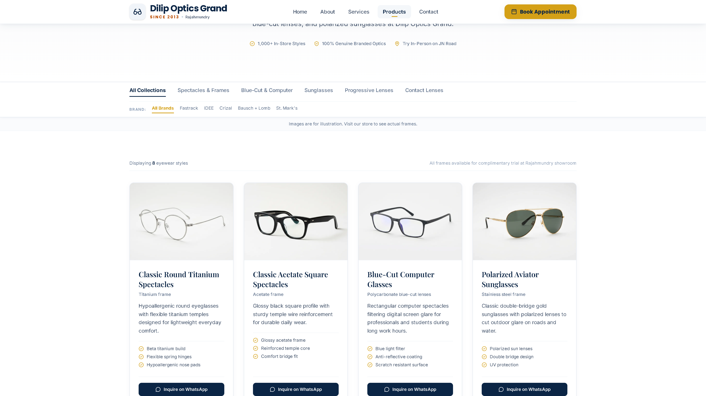
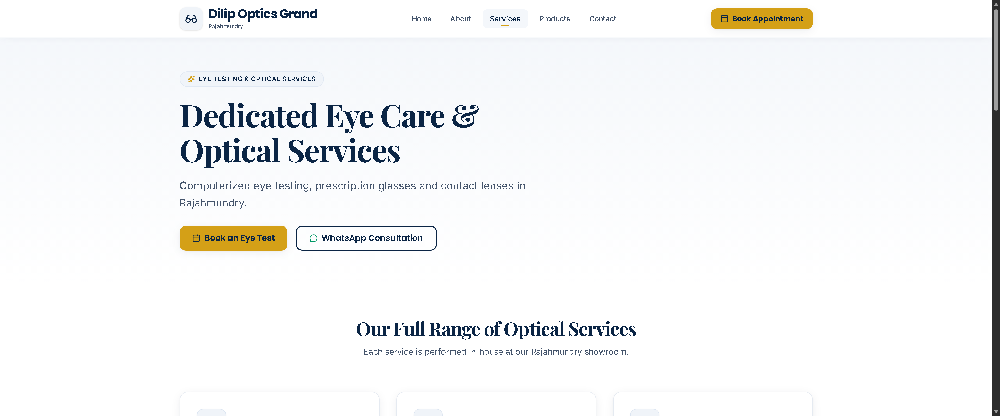

<div align="center">


<br/>

A fast, mobile-first website for an optical showroom on JN Road, Rajahmundry.<br/>
Browse eyewear, learn about eye testing, then **WhatsApp**, **call** or **get directions** in one tap.

<br/>

[](https://dilip-opticals-website.vercel.app)

<br/>


</div>

<br/>

## 📑 Contents

[Highlights](#-highlights) · [Pages](#-pages) · [Screenshots](#-screenshots) · [Quick start](#-quick-start) · [Customise](#%EF%B8%8F-customise-in-2-minutes) · [Deploy](#-deploy) · [Structure](#-project-structure) · [Notes](#-content-notes) · [Roadmap](#%EF%B8%8F-roadmap)

<br/>

## ✨ Highlights

| | |
|---|---|
| 📱 **Mobile first** | Built for phones first, with a slide-down menu and large tap targets |
| 💬 **One-tap contact** | WhatsApp enquiry on every product, call and directions buttons |
| 🛍️ **Eyewear catalogue** | 8 styles, category tabs, Quick View, and a brands section |
| 📅 **Appointment request** | Simple form with name, phone, date and time slot |
| 📍 **Find us easily** | Address, opening hours and an embedded Google Map |
| 🔎 **Search ready** | Meta tags, Open Graph, LocalBusiness JSON-LD, sitemap and robots.txt |
| ⚡ **Light and fast** | WebP images, lazy loading, no heavy UI libraries |

<br/>

## 🧭 Pages

| Page | What visitors get |
|---|---|
| **Home** | Storefront photo, rating and opening hours, featured collections, services preview |
| **Products** | Eyewear grid with category tabs, Quick View modal, WhatsApp enquiry buttons |
| **Services** | Computerized eye testing, prescription glasses, contact lenses, frame adjustment |
| **About** | Who we are, what we offer, where to find us |
| **Contact** | Appointment form, WhatsApp and call buttons, address, hours, map |

<br/>

## 🖼️ Screenshots

> Add your screenshots to `docs/screenshots/` and they will appear here.

| Home | Products |
|:---:|:---:|
|  |  |

| Services | Contact |
|:---:|:---:|
|  |  |

<br/>

## 🚀 Quick start

You need **Node.js 20.19 or newer** and **npm**.

```bash
git clone https://github.com/lokesh-varma28/dilip-opticals-website.git
cd dilip-opticals-website
npm install
npm run dev
```

Open the local address printed in the terminal (usually `http://localhost:5173`).

| Command | What it does |
|---|---|
| `npm run dev` | Start the development server |
| `npm run build` | Create a production build in `dist/` |
| `npm run preview` | Preview the production build locally |
| `npm run lint` | Check the code with Oxlint |

<br/>

## ⚙️ Customise in 2 minutes

Everything about the business lives in **one file**: `src/data/business.js`.

| Change | Where |
|---|---|
| Name, phone, WhatsApp number | `business.js` |
| Address, hours, map link | `business.js` |
| Social links (Instagram shows only when a valid link is set) | `business.js` |
| Storefront and showroom photos | `business.js` and `src/assets/` |
| Product photos | `src/assets/products/` (keep the same filenames) |
| Colours and fonts | `src/index.css` (`@theme` tokens) |

**Marketing claims** such as years in business, customer counts or guarantees live under `business.claims` and are `null` by default. A claim appears on the site only after you add a confirmed value.

### Colour palette

| Name | Swatch | Hex |
|---|---|---|
| Navy |  | `#0B2545` |
| Gold |  | `#D4A017` |
| Surface |  | `#F2F3F5` |

<br/>

## ☁️ Deploy

The site is a static single-page app and works on Vercel with zero setup.

1. Push the repository to GitHub.
2. In Vercel, choose **Add New, Project** and import the repository.
3. Keep the detected settings (Framework: Vite, Build: `npm run build`, Output: `dist`).
4. Click **Deploy**. Every push to the main branch redeploys automatically.

`vercel.json` already handles clean URLs and single-page routing.

<br/>

## 📁 Project structure

<details>
<summary>Click to expand</summary>

```text
dilip-opticals-website/
├── public/                 # favicon, sitemap.xml, robots.txt, social image
├── src/
│   ├── assets/
│   │   └── products/       # optimised WebP product images
│   ├── components/         # Navbar, Hero, Footer, TrustedBrands, ...
│   ├── data/
│   │   └── business.js     # single source of truth for business details
│   ├── pages/              # Home, About, Services, Products, Contact, NotFound
│   ├── index.css           # Tailwind v4 theme tokens
│   └── main.jsx
├── index.html              # meta tags, Open Graph, JSON-LD
├── vercel.json             # clean URLs and SPA rewrites
└── package.json
```

</details>

<br/>

## 📝 Content notes

- **Product images are illustrative.** To show real stock, replace the files in `src/assets/products/` with photos of the actual frames, using the same filenames.
- **The brand filter is switched off** (`SHOW_BRAND_FILTER = false` in `Products.jsx`) until the brand-to-product mapping is confirmed.
- **Business details** (rating, hours, phone) should be checked against the shop's Google Business profile before launch.

<br/>

## 🗺️ Roadmap

- [ ] Replace illustrative images with real showroom photography
- [ ] Confirm and add the list of brands, then re-enable the brand filter
- [ ] Add a Telugu language option
- [ ] Mobile quick-action bar (Call, WhatsApp, Directions)
- [ ] Lighthouse pass for mobile performance and accessibility

<br/>

## 📄 License and credits

Built for **Dilip Optics Grand**. All business names, logos and brand marks belong to their respective owners.

<div align="center">

<br/>

Made with ☕ in Andhra Pradesh

</div>